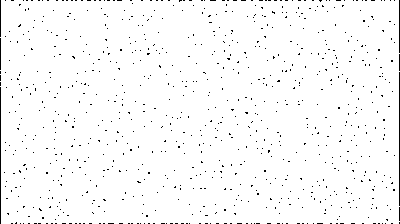

#bg_color.py

This script allows to clean an image with noisy background (ie: coloured
background). It is based in the combination of the operations GaussianBlur to
remove some of the background noise, and after a threshold which will turn the
image into a white and black image.

###Common arguments

These are some of the main arguments used in this module:

    - input_file: input file, can be a file path or an image (np array).
    - thresh_val: list of values used to threshold.
    - kernel_size: size of the window used to blur. As this values increases so
                    does the blur.
    - block_size: size of the block used in adaptive thresholding.
    - c: constraint to diminish the block mean.
    - thresh_type: value between 0 and 4   (0-THRESH_BINARY;
                                            1-THRESH_BINARY_INV;
                                            2-THRESH_TRUNC,
                                            3-THRESH_TOZERO,
                                            4-THRESH_TOZERO_INV)

###Import

To import this module into your application, you must include the following
line at the beginning of your own python file:

        import bg_color as bgc

###Functions

In this section you'll find a summary of each function included in this module
except the *check_argument* functions, which always return either 0 or an
exception if any parameter is out of it's limits.

- ####remove_bg(input_file, thresh_val=0, window_size=3, block_size=11, c=5, thresh_type=0):

    Loads the image, it applies a Gaussian Blur with the kernel_size and after it
 uses the threshold module to apply a specific threshold determined by thresh_type.

    Returns: a single image, the input_file cleaned.

###Examples

This is an example to illustrate the use of the remove_bg function. Imagine that we have an image with a colored noisy background, perhaps such as this one:

If we apply remove_bg to the image with the default values we get:

As you can see, the result obtained doesn't have neither the gray background nor the massive amount of noise of the source image. However, if the original image has a lot of noise, bg_color is not able to remove the noise completely
