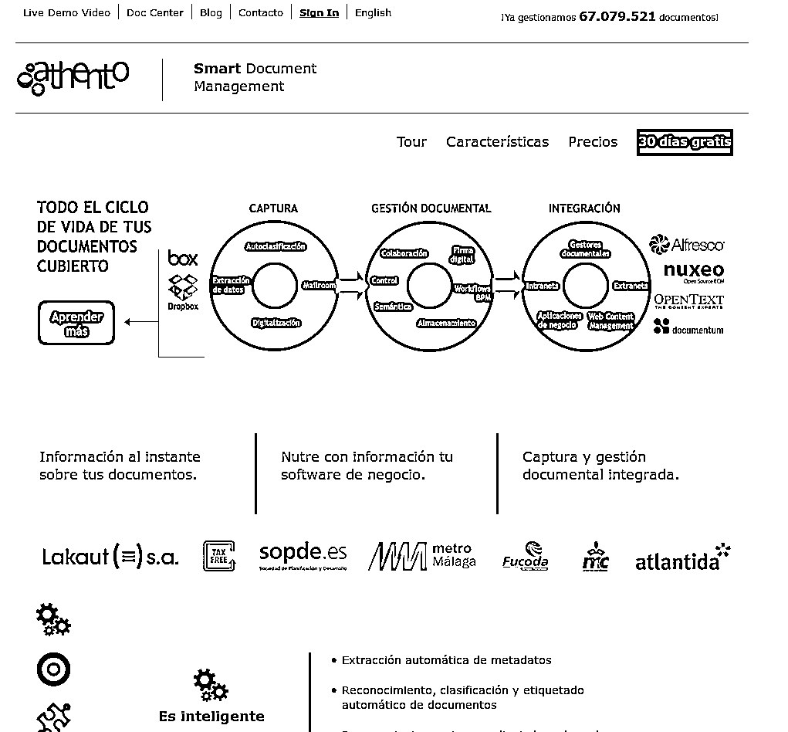
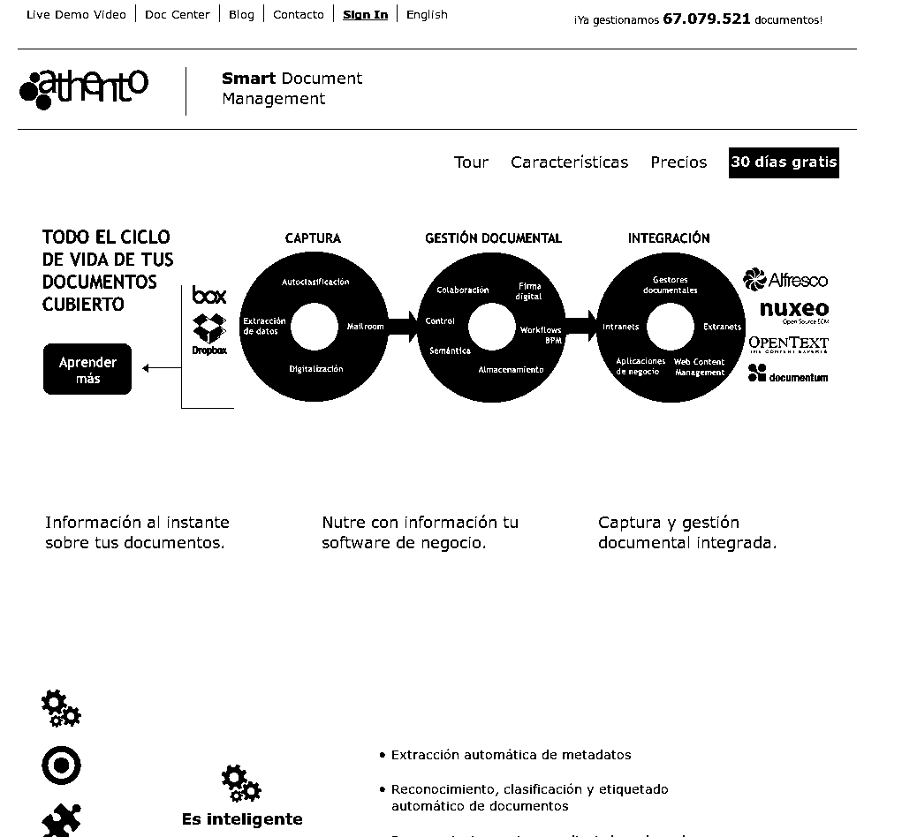

#threshold.py

This script implement a series of functions to implement the most commonly used threshold functions in OpenCV.

###Common arguments

These are some of the main arguments used in this module:

    - input_file: input file, can be a file path or an image (np array).
    - thresh_type: value between 0 and 4   (0-THRESH_BINARY;
                                            1-THRESH_BINARY_INV;
                                            2-THRESH_TRUNC,
                                            3-THRESH_TOZERO,
                                            4-THRESH_TOZERO_INV)

###Import

To import this module into your application, you must include the following 
line at the beginning of your own python file:

        import threshold as th

###Functions

In this section you'll find a summary of each function included in this module
except the *check_argument* functions, which always return either 0 or an
exception if any parameter is out of it's limits.

- ####adaptive_threshold(input_file, max_val=255, thresh_type=0, block_size=11, c=5, cv_threshold=cv.ADAPTIVE_THRESH_GAUSSIAN_C)

    - max_val: the maximum value that the adaptive threshold can set.
    - block_size: the size of the block used in adaptive thresholding.
    - c: a constraint to be subtracted in adaptive thresholding.
    - cv_threshold: either Gaussian (cv2.ADAPTIVE_THRESH_GAUSSIAN_C)
    or Mean (cv2.ADAPTIVE_THRESH_MEAN_C)

    Returns: the input image after a adaptive gaussian threshold.

- ####threshold(input_file, thresh_val=200, new_value=255, thresh_type=0)

    - thresh_val: minimum value of the pixel to apply the threshold.
    - new_value: new value of each pixel which initial value
     was equal or greater than thresh_val.

    Returns: the input image after simple threshold.

###Examples

In this case we will check the difference between the standard and the adaptive thresholds.

We'll use this image as source:

Applying *adaptive_threshold()* we obtain:

Applying the standard *threshold()*:

